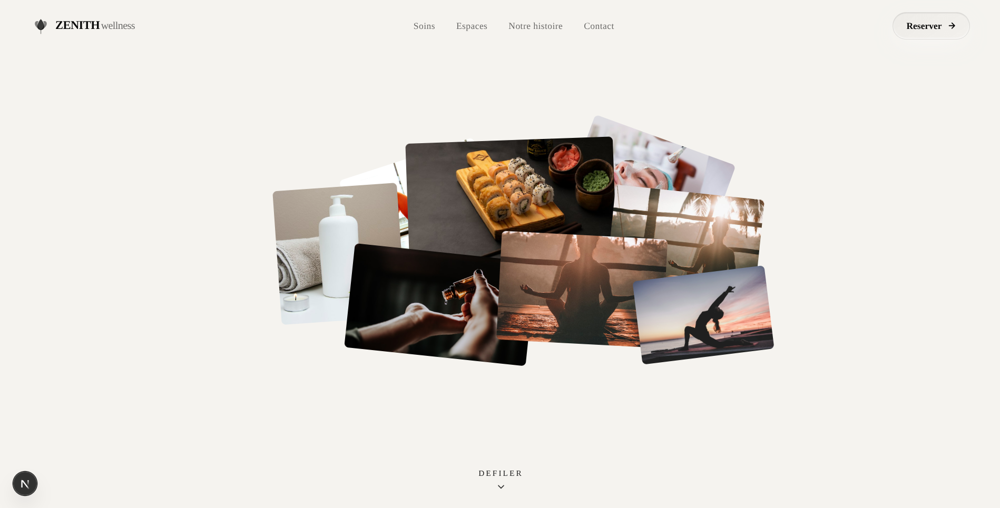
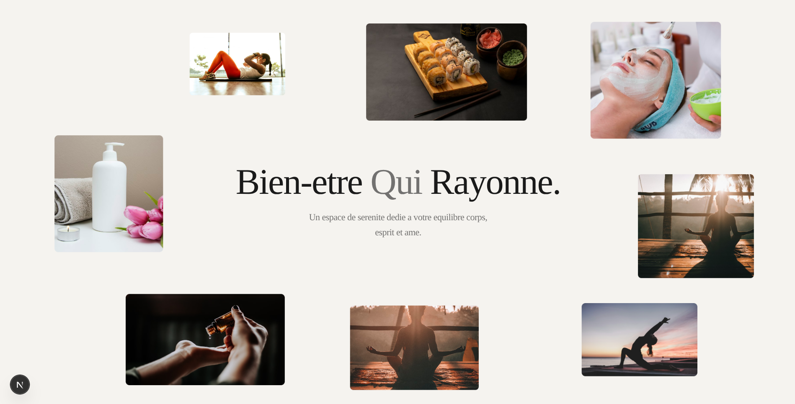
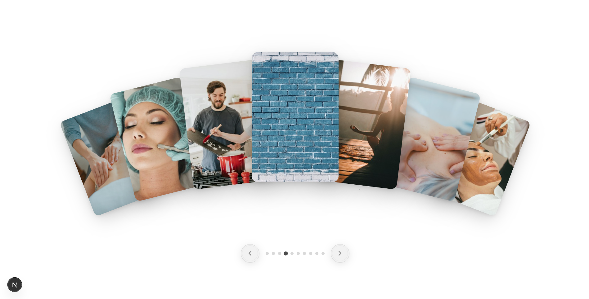
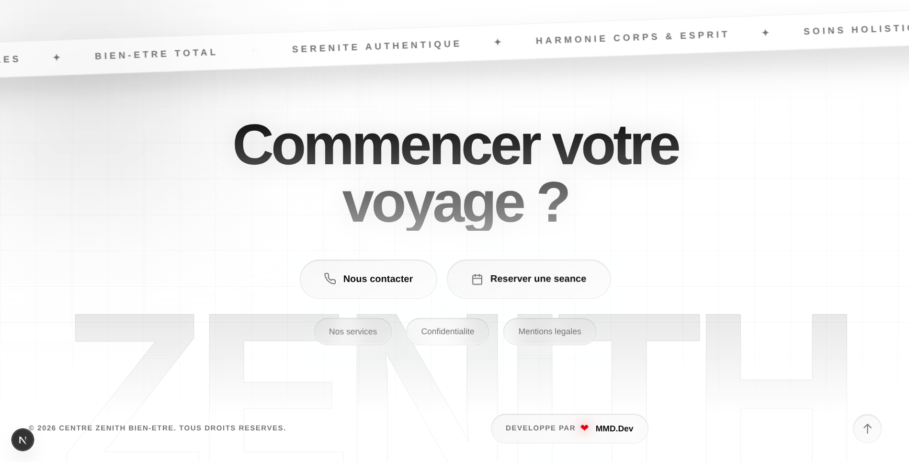

# Zenith Wellness — Centre de Bien-être Holistique

A **premium holistic wellness website** built with Next.js 16, React 19, TypeScript, Tailwind CSS v4, Motion and GSAP, featuring scroll-driven card scattering, an interactive fan carousel, pinned story scroll sections, custom cursor physics and a fully responsive layout.

---

## Features

- Custom cursor with sage green dot, delayed trailing ring, and interactive hover expansion (disabled automatically on mobile/touch)
- Stack Spread Hero with scroll-driven card scattering, 3D pointer parallax, and smooth spring physics
- Section reveal with masked letter/word reveals and staggered slide-ins via GSAP ScrollTrigger
- Card Fan Carousel with 3D fan layout, interactive hover physics, pagination controls and touch swipe gesture support for mobile
- Pinned Story Scroll experience with rotating entrance transitions, card grids and pinned multi-stage narrative flow
- Glassmorphism UI design system with curated OKLCH color palettes, subtle glowing borders, and backdrop-blur pills
- 3D Magnetic buttons with spring elastic physics on mouse tracking
- Infinite scrolling marquee ticker with rotating animated badge
- Seamless navigation header with animated underline links and mobile glassmorphic drawer menu
- Dynamic year and developer badge with animated heartbeat pulse
- Fully responsive — optimized for mobile, tablet, and ultra-wide screens without compromising desktop aesthetics

---

## Technologies Used

- **Next.js 16 (App Router)** – Modern React framework with Turbopack, server-side rendering and file-based metadata
- **React 19** – Component-based architecture with hooks and concurrent features
- **TypeScript 5** – Static type checking for rock-solid reliability
- **Tailwind CSS v4** – Modern utility-first styling with OKLCH theme variables and CSS Grid
- **GSAP 3.15 + ScrollTrigger** – High-performance timeline sequences, pinned story scrolling and reveals
- **Motion (Framer Motion)** – Spring physics, scroll interpolation, and fluid layout transforms
- **Shadcn UI & Radix UI** – Accessible, customizable component architecture
- **Geist Font** – Contemporary geometric typography optimized via `next/font`

---

## Preview

